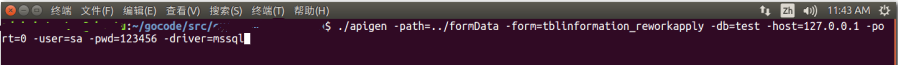

# apigen
According to the data dictionary automatically generate beego framework api, model layer using gorm

# Installation
> go get github.com/hwfy/apigen

# Usage
"base" is the database name,  "self" in childs is foreign key, "link" is the associated primary table field:
```json
{
	"ID": "t2018080314464650340",
	"Name": "tblinformation_reworkapply",
	"PKey": "ID",
	"Base": "test",
	"Chinese": "程式增修申����",
	"Fields": [{
			"TableID": "t2018080314464650340",
			"Name": "ID",
			"Chinese": "序号",
			"Type": "5",
			"Length": "50"
		}, {
			"TableID": "t2018080314464650340",
			"Name": "BillNo20",
			"Chinese": "程式增修�尉���",
			"Type": "1",
			"Length": "50"
		},
		{
			"TableID": "t2018080314464650340",
			"Name": "systemname",
			"Chinese": "程式增修系�y名�Q",
			"Type": "1",
			"Length": "100"
		},
		{
			"TableID": "t2018080314464650340",
			"Name": "Enter_User",
			"Chinese": "申请人",
			"Type": "1",
			"Length": "24"
		}, {
			"TableID": "t2018080314464650340",
			"Name": "Enter_Time",
			"Chinese": "申请日期",
			"Type": "3",
			"Length": "10"
		}, {
			"TableID": "t2018080314464650340",
			"Name": "SH_Status",
			"Chinese": "审核状态",
			"Type": "5",
			"Length": "1"
		}
	],
	"Childs": [{
		"Target": "tblinformation_reworkapply",
		"Name": "tblinformation_reworkapply_Sub2",
		"Self": "ParentID",
		"Link": "ID"
	}, {
		"Target": "tblinformation_reworkapply",
		"Name": "vwcomputerdevelop_users",
		"Self": "staff_name",
		"Link": "designer"
	}, {
		"Target": "tblinformation_reworkapply",
		"Name": "tblinformation_reworkapply_FunctionDetail",
		"Self": "ParentID",
		"Link": "ID"
	}],
	"Parents": []
}
```
There are two ways to generate api, one from the command line generation, one from the file batch generation:
## 1.command line


## 2.file
replace -form with -forms = file name, you can also enter "apigen" generated directly, the other command parameters from "app.conf" load


----------
After the controller will generate control files, routers produce routing files, models produce all the associated table model file, for example:
```go
package models

import (
	"fmt"
	"strconv"
	"time"

	"github.com/jinzhu/gorm"
)

type TblinformationReworkapply struct {
	ID                      int        `gorm:"column:ID;size:50;primary_key;AUTO_INCREMENT" json:"ID"`            //序号
	BillNo20                string     `gorm:"column:BillNo20;size:50" json:"BillNo20"`                           //程式增修�尉���
	Systemname              string     `gorm:"column:systemname;size:100" json:"systemname"`                      //程式增修系�y名�Q
	EnterUser               string     `gorm:"column:Enter_User;size:24" json:"Enter_User"`                       //申请人
	EnterTime               *time.Time `gorm:"column:Enter_Time;size:10" json:"Enter_Time"`                       //申请日期
	SHStatus                int        `gorm:"column:SH_Status;size:1" json:"SH_Status"`                          //审核状态

	TblinformationReworkapplySub2ID           []TblinformationReworkapplySub2           `gorm:"ForeignKey:ParentID;AssociationForeignKey:ID" json:"tblinformation_reworkapply_Sub2_ID"`
	VwcomputerdevelopUsersDesigner            []VwcomputerdevelopUsers                  `gorm:"ForeignKey:staff_name;AssociationForeignKey:designer" json:"vwcomputerdevelop_users_designer"`
	TblinformationReworkapplyFunctionDetailID []TblinformationReworkapplyFunctionDetail `gorm:"ForeignKey:ParentID;AssociationForeignKey:ID" json:"tblinformation_reworkapply_FunctionDetail_ID"`
}

// TableName 将TblinformationReworkapply映射为tblinformation_reworkapply
func (table TblinformationReworkapply) TableName() string {
	return testDbName() + ".dbo.tblinformation_reworkapply"
}

func NewTblinformationReworkapply() *TblinformationReworkapply {
	table := new(TblinformationReworkapply)

	return table
}

// GetTblinformationReworkapplys: 获取所有程式增修申���渭锹�
func GetTblinformationReworkapplys(qs map[string]interface{}, joins, fields []string, sortby string, offset int64, limit int64) ([]TblinformationReworkapply, error) {
	db, err := gorm.Open(testDataSource())
	if err != nil {
		return nil, fmt.Errorf("创建orm引擎失败, %s", err)
	}
	defer db.Close()

	if sortby != "" {
		db = db.Order(sortby)
	}
	for _, join := range joins {
		db = db.Joins(join)
	}

	if offset > 0 {
		var ids []string
		var id string

		rows, _ := db.
			Table("tblinformation_reworkapply").
			Select("TOP " + strconv.FormatInt(offset, 10) + " ID").
			Where(qs).
			Rows()

		for rows.Next() {
			rows.Scan(&id)
			ids = append(ids, id)
		}
		db = db.Where("ID NOT IN(?)", ids)
	}
	limitStr := strconv.FormatInt(limit, 10)
	fields[0] = "top " + limitStr + fields[0]

	var records []TblinformationReworkapply

	query := db.
		Preload("TblinformationReworkapplySub2ID").
		Preload("VwcomputerdevelopUsersDesigner").
		Preload("TblinformationReworkapplyFunctionDetailID").
		Select(fields).
		Where(qs).
		Find(&records)

	if query.Error != nil {
		return nil, fmt.Errorf("获取所有程式增修申���渭锹际О埽�%s", query.Error)
	}
	return records, nil
}

// GetTblinformationReworkapplyByCondition: 根据给定条件获取程式增修申���渭锹�
func GetTblinformationReworkapplyByCondition(qs interface{}, args ...interface{}) ([]TblinformationReworkapply, error) {
	db, err := gorm.Open(testDataSource())
	if err != nil {
		return nil, fmt.Errorf("创建orm引擎失败, %s", err)
	}
	defer db.Close()

	var records []TblinformationReworkapply

	query := db.
		Preload("TblinformationReworkapplySub2ID").
		Preload("VwcomputerdevelopUsersDesigner").
		Preload("TblinformationReworkapplyFunctionDetailID").
		Where(qs, args...).
		Find(&records)

	if query.Error != nil {
		return nil, fmt.Errorf("获取程式增修申���渭锹际О埽�%s", query.Error)
	}
	return records, nil
}

// GetTblinformationReworkapplyByPK: 根据主键获取程式增修申���渭锹�
func GetTblinformationReworkapplyByPK(ID int) (*TblinformationReworkapply, error) {
	db, err := gorm.Open(testDataSource())
	if err != nil {
		return nil, fmt.Errorf("创建orm引擎失败, %s", err)
	}
	defer db.Close()

	var record TblinformationReworkapply

	query := db.
		Preload("TblinformationReworkapplySub2ID").
		Preload("VwcomputerdevelopUsersDesigner").
		Preload("TblinformationReworkapplyFunctionDetailID").
		Where("ID=?", ID).
		Find(&record)

	if query.Error != nil {
		return nil, fmt.Errorf("获取程式增修申���渭锹际О埽�%s", query.Error)
	}
	return &record, nil
}

// Update: 更新程式增修申���渭锹�
func (table *TblinformationReworkapply) Update() error {
	db, err := gorm.Open(testDataSource())
	if err != nil {
		return fmt.Errorf("创建orm引擎失败, %s", err)
	}
	defer db.Close()

	//开启事务
	tx := db.Begin()
	up := tx.Save(&table)

	if up.Error != nil {
		tx.Rollback()
		return fmt.Errorf("更新程式增修申���问О�, %s", up.Error)
	}
	tx.Commit()

	return nil
}

// UpdateByCondition: 根据指定条件更新程式增修申���渭锹�
func (table *TblinformationReworkapply) UpdateByCondition(qs string, args ...interface{}) error {
	db, err := gorm.Open(testDataSource())
	if err != nil {
		return fmt.Errorf("创建orm引擎失败, %s", err)
	}
	defer db.Close()
	//开启事务
	tx := db.Begin()

	up := tx.
		Model(&TblinformationReworkapply{}).
		Where(qs, args...).
		Update(&table)

	if up.Error != nil {
		tx.Rollback()
		return fmt.Errorf("更新程式增修申���问О�, %s", up.Error)
	}
	tx.Commit()

	return nil
}

// Insert: 新建程式增修申���渭锹�
func (table *TblinformationReworkapply) Insert() error {
	db, err := gorm.Open(testDataSource())
	if err != nil {
		return fmt.Errorf("创建orm引擎失败, %s", err)
	}
	defer db.Close()

	save := db.Save(&table)
	if save.Error != nil {
		return fmt.Errorf("新建程式增修申���渭锹际О�, %s", save.Error)
	}
	return nil
}

// Delete: 删除程式增修申���渭锹�
func (table TblinformationReworkapply) Delete() error {
	db, err := gorm.Open(testDataSource())
	if err != nil {
		return fmt.Errorf("创建orm引擎失败, %s", err)
	}
	defer db.Close()

	del := db.Delete(&table)
	if del.Error != nil {
		return fmt.Errorf("删除程式增修申���渭锹际О�, %s", del.Error)
	}
	return nil
}

// DeleteByCondition: 根据指定条件删除程式增修申���渭锹�
func (table TblinformationReworkapply) DeleteByCondition(qs string, args ...interface{}) error {
	db, err := gorm.Open(testDataSource())
	if err != nil {
		return fmt.Errorf("创建orm引擎失败, %s", err)
	}
	defer db.Close()

	del := db.
		Where(qs, args...).
		Delete(&table)

	if del.Error != nil {
		return fmt.Errorf("删除程式增修申���渭锹际О�, %s", del.Error)
	}
	return nil
}
```